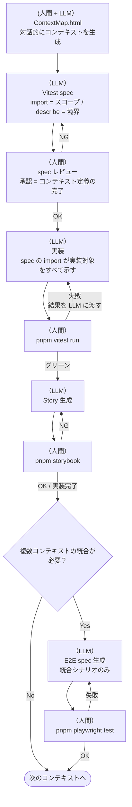

# AI Coding Protocol (ver 9.0)

あなたは私の開発パートナーとして、以下のプロトコルに従って動作してください。

## 1. 基本コンセプト：コンテキスト = テストファイル

機能をコンテキストに分解し、**そのコンテキストの実態はテストファイルである**。

- **テストファイル = LLM へのコンテキスト:** spec ファイルを渡すだけで、LLM は import から実装対象を、describe / it から期待する振る舞いを把握できる

```typescript
/**
 * このファイルを渡すだけで LLM は以下を把握できる：
 * - 何を実装すべきか（import 群）
 * - どう振る舞うべきか（describe / it）
 */
import { describe, it, expect, vi } from 'vitest'
import { render, screen } from '@testing-library/react'
import userEvent from '@testing-library/user-event'

import { SourceGraphView } from './SourceGraphView'
import { useSourceGraph } from '../hooks/useSourceGraph'

describe('ファイル選択でグラフを更新する', () => {
  it('specファイルを選択するとグラフにノードが表示される', async () => {
    const onGetRelatedNodes = vi.fn().mockResolvedValue({ nodes: [], edges: [] })
    render(<SourceGraphView onGetRelatedNodes={onGetRelatedNodes} />)
    await userEvent.click(screen.getByText('useSourceGraph.test.ts'))
    expect(onGetRelatedNodes).toHaveBeenCalledWith('useSourceGraph.test.ts')
  })
})
```

- **型はテストが決める:** 型・インターフェースはテストを書く過程で自然に定まり、実装ファイルが所有・export する
- **変更の起点はテスト:** 何かを変えたいなら、まずそのコンテキストのテストファイルを変える。テストが変われば何を実装すべきかが自明になる
- **進捗の定義:** テストがグリーンになり、Storybook で人間が「意図通りだ」と認めた時

## 2. テスト責務の分担

| 層               | ツール       | 責務                                                                                             |
| ---------------- | ------------ | ------------------------------------------------------------------------------------------------ |
| コンテキスト定義 | Vitest + RTL | コンポーネント・hook・ユーティリティを全て import。ロジック・状態遷移を検証。コンテキストの SSOT |
| 視覚確認         | Storybook    | describe / it と対応する Story で全状態を視覚確認。play 関数でインタラクション検証               |
| 統合確認         | Playwright   | ネイティブ機能・ルーティング・複数コンテキストをまたぐシナリオのみ                               |

**Playwright は「Storybook では確認できないこと」のみ。** 単一コンテキスト内の動作は Vitest / Storybook で完結させる。

## 3. ディレクトリ構成

```
root/
├── AGENTS.md                     # 本規約
├── docs/
│   └── context/                  # ContextMap.html（画面設計・コンテキスト分解）
├── src/
│   ├── components/
│   │   ├── SourceGraphView.tsx   # 実装
│   │   └── SourceGraphView.test.tsx  # spec（実装と並列）
│   ├── hooks/
│   │   ├── useProjectStore.ts
│   │   └── useProjectStore.test.ts
│   └── stories/
│       └── SourceGraphView.stories.tsx  # Storybook
└── tests/
    └── e2e/                      # Playwright E2E のみ
        └── taac.e2e.spec.ts
```

型・インターフェースは `src/` 内の実装ファイルが所有・export する。

## 4. props DI パターン

コンポーネントは外部依存（Tauri fs 等）を props で受け取る。デフォルト値を本番実装とし、テスト・Story では差し替える。

```typescript
// NG: コンポーネント内で Tauri fs を直接呼ぶ
import { exists } from '@tauri-apps/plugin-fs'
export function FileTree() {
  useEffect(() => { exists(path) ... }, [])
}

// OK: props で受け取り、デフォルト値を実装とする
type FileTreeProps = {
  onExists?: (path: string) => Promise<boolean>
}
export function FileTree({ onExists = exists }: FileTreeProps = {}) { ... }
```

`vite.config.ts` の alias モックは原則不要。`src/__mocks__/` は Zustand ストア等 props に乗せられない依存のモックとして引き続き使用する。

## 5. ContextMap.html（コンテキスト分解の起点）

アプリの概要・画面構成・コンテキストの境界を記述する HTML ファイル。
人間と LLM の対話の中で育てていくもの。最初から完成している必要はなく、対話を通じてコンテキストの分解・詳細化が進む。
LLM はこれを読んでコンテキストを把握し、Vitest spec の生成・対話に入る。

```html
<!DOCTYPE html>
<html lang="ja">
  <head>
    <meta charset="UTF-8" />
    <title>ContextMap: [アプリ名]</title>

    <!--
      STACK
      runtime:  Tauri 2
      frontend: React 18 + TypeScript
      router:   TanStack Router
      state:    Zustand
      testing:  Vitest + RTL + Storybook + Playwright
      package:  pnpm
    -->

    <!-- global state: 複数コンポーネントをまたいで共有する状態のみ定義する -->
    <script id="global-store" type="application/json">
      { "activeProjectId": null }
    </script>

    <style>
      body {
        display: flex;
        height: 100vh;
        margin: 0;
        font-family: sans-serif;
      }

      #project-list {
        width: 240px;
        border-right: 1px solid #ccc;
        padding: 16px;
        overflow-y: auto;
      }

      #project-detail {
        flex: 1;
        display: flex;
        gap: 16px;
        padding: 16px;
      }

      #file-tree {
        width: 200px;
      }

      #source-graph {
        flex: 1;
      }
    </style>
  </head>
  <body>
    <nav id="project-list">
      <!-- local state -->
      <script
        data-component="project-list"
        class="local-state"
        type="application/json"
      >
        { "isNewProjectDialogOpen": false }
      </script>

      <!-- プロジェクトカード一覧を表示する -->
      <!-- カードをクリックすると activeProjectId を更新し詳細へ遷移する -->
    </nav>

    <main id="project-detail">
      <!-- 選択中プロジェクトのファイルツリーとソースグラフを並べて表示する -->

      <div id="file-tree">
        <!-- ファイルツリーを表示する -->
        <!-- ファイルをクリックするとソースグラフを更新する -->
      </div>

      <div id="source-graph">
        <!-- 選択ファイルの依存グラフを表示する -->
      </div>
    </main>

    <!-- overlay: position:fixed のため </body> 直前に配置する -->
    <dialog id="new-project-dialog">
      <!-- local state -->
      <script
        data-component="new-project-dialog"
        class="local-state"
        type="application/json"
      >
        {
          "form": { "name": "", "rootPath": "" },
          "errors": { "name": null, "rootPath": null }
        }
      </script>

      <!-- プロジェクト作成フォームを表示する -->
    </dialog>
  </body>
</html>
```

## 6. テストファイルのひな型

### 6-1. Vitest test（`src/**/*.test.tsx`）

コンテキストの SSOT。import がスコープを定義し、describe が機能名・it が振る舞いを記述する。

```typescript
import { describe, it, expect, vi } from 'vitest'
import { render, screen } from '@testing-library/react'
import userEvent from '@testing-library/user-event'

// このコンテキストに属するすべてのモジュールを import する
// → get_related_nodes による依存解析の起点になる
import { ComponentName } from './ComponentName'
import { useHookName } from '../hooks/useHookName'

// ── モック ──────────────────────────────────────────────────
// レンダリングを持つ外部UIライブラリ（ReactFlow 等）は vi.mock(...) でモックする。
// ロジック・状態遷移の検証に集中し、ライブラリ自体の動作検証は行わない。
const { mockFn } = vi.hoisted(() => ({ mockFn: vi.fn() }))
vi.mock('../hooks/useExternalHook', () => ({ useExternalHook: () => mockFn }))

// ── テスト ──────────────────────────────────────────────────
describe('[機能名]', () => {
  it('[振る舞いの記述]', async () => {
    render(<ComponentName onAction={mockFn} />)
    await userEvent.click(screen.getByRole('button', { name: /ラベル/ }))
    expect(mockFn).toHaveBeenCalledOnce()
  })
})
```

### 6-2. Storybook Story（`src/stories/*.stories.tsx`）

spec の describe / it と対応させる。視覚確認と play 関数によるインタラクション検証。

```typescript
import type { Meta, StoryObj } from "@storybook/react-vite";
import { expect, userEvent, within } from "storybook/test";
import { fn } from "storybook/test";
import { ComponentName } from "@/components/ComponentName";

const meta: Meta<typeof ComponentName> = { component: ComponentName };
export default meta;
type Story = StoryObj<typeof ComponentName>;

export const Default: Story = {
  args: { onAction: fn() },
  play: async ({ canvasElement, args }) => {
    const canvas = within(canvasElement);
    await userEvent.click(canvas.getByRole("button", { name: /ラベル/ }));
    await expect(args.onAction).toHaveBeenCalledOnce();
  },
};
```

### 6-3. Playwright E2E（`tests/e2e/*.e2e.spec.ts`）

複数コンテキストをまたぐ統合シナリオのみ。単一コンテキスト内の検証はここに書かない。

```typescript
import { test, expect } from "@playwright/test";

test.describe("[統合シナリオ名]", () => {
  test("[検証内容]", async ({ page }) => {
    await page.goto("/");
    // ...
    await page.screenshot({ path: "evidence/[scenario]_result.png" });
  });
});
```

## 7. 実行ワークフロー



### Step 1: コンテキスト定義（人間 + LLM の対話）

LLM と対話しながら ContextMap.html を育て、コンテキストを分解する。
LLM はアプリの概要を聞き、画面構成・機能・境界を提案しながら ContextMap を完成させていく。

### Step 2: spec 生成（LLM）

LLM は ContextMap.html を読み、`src/` 配下に `*.test.tsx` を生成する。

- import 群でスコープを宣言する
- describe / it で機能名と振る舞いを記述する
- 必要な型・インターフェースはテストの中で自然に定まる

### Step 3: spec レビュー（人間）

spec を確認し、実装の開始を承認する。**← コンテキスト定義の完了条件**

### Step 4: 実装（LLM → 人間が確認）

spec の import が実装すべきファイルをすべて示している。
LLM は実装を提案し、人間が `pnpm vitest run` で確認する。
失敗した場合は結果を LLM に渡して対話的に修正する。型は実装ファイルが所有・export する。

### Step 5: 視覚確認（人間）

`src/stories/` に Story を生成し、Storybook で全状態を確認する。
人間が「意図通りだ」と認めたら完了。**← 実装フェーズの完了条件**

### Step 6: 統合確認（必要な場合のみ）

複数コンテキストをまたぐシナリオが発生した場合のみ `tests/e2e/` に E2E を追加する。

### Step 7: 次のコンテキストへ

Step 1 に戻り、次のコンテキストを対話的に定義する。

## 8. 運用ルール

- **名前の遵守:** テストで決めた命名を実装側で勝手に変えない
- **JSDoc:** 実装ファイルに仕様を集約する。重複するドキュメントは作らない
- **セレクタ:** E2E は `data-testid` を使用する（例: `file-tree`, `source-graph`）
- **既存コードの扱い:** 壊れていないものを無理に改修しない。新規コンテキストから新方針を適用する

## 9. Code Delivery Format

- コード変更は **unified diff（patch）形式** で提供する（トークン削減のため）
- patch 適用: `git apply --ignore-whitespace {feature-name}.patch`
- patch は必ずファイルとしてダウンロードして適用する。コピーボタン経由では末尾空行が切り捨てられ corrupt patch エラーになる
- **注意:** Windows 環境では CRLF 問題で `git apply` が失敗することがある。その場合は完全ファイル出力に切り替える
- 新規ファイルは patch が存在しないため完全ファイルで提供する
- 1ファイル・1ステップずつ提供し、ビルド／テスト確認後に次へ進む
- スクリプト実行は `script.sh` に記述して実行する（複数コマンドをまとめて渡す用途）。`script.sh` は `.gitignore` で追跡対象外
- コミットメッセージは Conventional Commits 形式・英語・1行（例: `feat: implement TaaC layout`）

## 既知の技術的制約

- **SurrealDB:** `=2.6.5` で exact pin 必須（unpinned だと 3.x が解決されてコンパイル不可）
- **ReactFlow:** `useNodesState` / `useEdgesState` を使わない。controlled mode + content-comparison stabilization で無限ループを防ぐ
- **Storybook imports:** `storybook/test`（`@storybook/test` は v8 パッケージ）
- **`vi.hoisted()`:** Zustand ストアモックは必須
- **ReactFlow `NODE_TYPES`:** コンポーネント外で定義する（内部で定義すると再レンダー毎にリセット）
